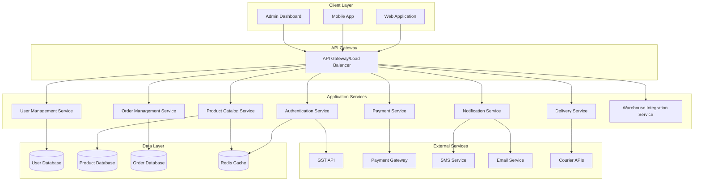
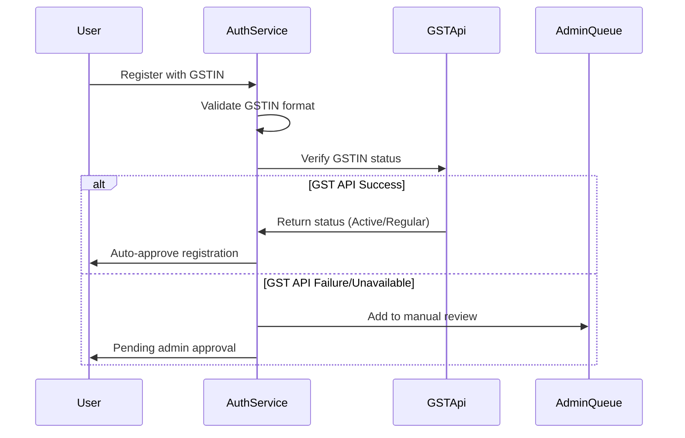
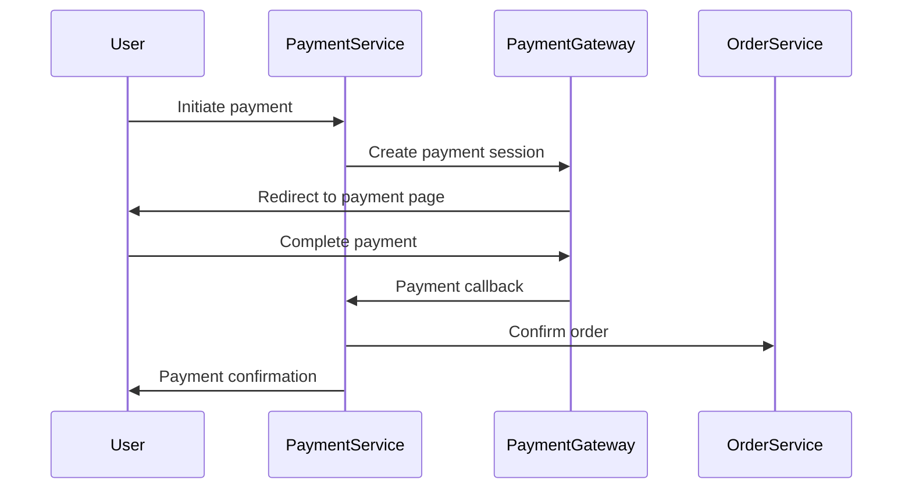

# Design Document

## Overview

The Anon B2B E-commerce Platform is a comprehensive web application designed to facilitate business-to-business transactions between Anon company and retail stores/companies across India. The system features location-based delivery scheduling, tiered pricing, automated GST verification, and integrated payment processing.

### Key Design Principles

- **Scalability**: Microservices architecture to handle growing business demands
- **Security**: Multi-layer security with GST verification and secure payment processing
- **Performance**: Optimized for fast order processing and real-time inventory updates
- **Reliability**: Robust error handling and fallback mechanisms
- **User Experience**: Intuitive interfaces tailored for business users

## Architecture

### High-Level Architecture



### Technology Stack

**Frontend:**
- React.js with TypeScript for web application
- React Native for mobile application
- Material-UI/Ant Design for component library
- Redux Toolkit for state management

**Backend:**
- Node.js with Express.js framework
- TypeScript for type safety
- JWT for authentication
- Redis for caching and session management

**Database:**
- PostgreSQL for primary data storage
- Redis for caching and real-time data
- MongoDB for logs and analytics (optional)

**Infrastructure:**
- Docker containers for deployment
- AWS/Azure cloud infrastructure
- CDN for static asset delivery
- Load balancer for high availability

## Components and Interfaces

### 1. Authentication Service

**Purpose:** Handle user registration, login, GST verification, and session management

**Key Components:**
- GST Verification Module
- User Registration Handler
- Login/Logout Manager
- Session Management
- Admin Approval Workflow

**API Endpoints:**
```typescript
POST /auth/register
POST /auth/login
POST /auth/logout
GET /auth/verify-gst/:gstin
POST /auth/refresh-token
GET /auth/pending-approvals (admin only)
POST /auth/approve-user/:userId (admin only)
```

**GST Verification Flow:**


### 2. User Management Service

**Purpose:** Manage user profiles, business categorization, and category upgrades

**Key Components:**
- User Profile Manager
- Business Category Handler
- Upgrade Request Processor
- Document Verification Manager

**Data Models:**
```typescript
interface User {
  id: string;
  businessName: string;
  businessType: 'company' | 'retail';
  gstin?: string;
  gstVerified: boolean;
  categoryVerified: boolean;
  contactPerson: string;
  email: string;
  phone: string;
  address: Address;
  createdAt: Date;
  lastLogin: Date;
  status: 'pending' | 'active' | 'suspended';
}

interface Address {
  street: string;
  city: string;
  state: string;
  pincode: string;
  coordinates?: {
    latitude: number;
    longitude: number;
  };
}
```

### 3. Product Catalog Service

**Purpose:** Manage product inventory, pricing tiers, and availability

**Key Components:**
- Product Manager
- Pricing Engine
- Inventory Tracker
- Category Manager

**Pricing Strategy:**
```typescript
interface PricingTier {
  userType: 'company' | 'retail';
  basePrice: number;
  volumeDiscounts: VolumeDiscount[];
  minimumOrderQuantity: number;
}

interface VolumeDiscount {
  minQuantity: number;
  discountPercentage: number;
}
```

### 4. Order Management Service

**Purpose:** Handle order lifecycle, delivery scheduling, and status tracking

**Key Components:**
- Order Processor
- Delivery Calculator
- Status Tracker
- Order History Manager

**Delivery Calculation Logic:**
```typescript
interface DeliveryCalculator {
  calculateDeliveryTime(
    customerLocation: Address,
    orderTime: Date
  ): {
    estimatedDelivery: Date;
    deliveryType: 'express' | 'standard' | 'extended';
  };
}

// Nellore area detection
const isNelloreArea = (pincode: string): boolean => {
  const nellorepincodes = ['524001', '524002', '524003', '524004', '524101'];
  return nellorepincodes.includes(pincode);
};
```

### 5. Payment Service

**Purpose:** Handle payment processing, invoice generation, and transaction management

**Key Components:**
- Payment Gateway Integration
- Invoice Generator
- Transaction Manager
- Refund Handler

**Payment Flow:**


### 6. Notification Service

**Purpose:** Handle email and SMS notifications for various events

**Key Components:**
- Email Sender
- SMS Sender
- Template Manager
- Notification Queue

**Notification Types:**
- Registration confirmation
- Order confirmation
- Payment confirmation
- Delivery updates
- Admin approval notifications

### 7. Warehouse Integration Service

**Purpose:** Connect with warehouse management system for order fulfillment

**Key Components:**
- Order Dispatcher
- Inventory Sync
- Status Updater
- Tracking Generator

## Data Models

### Core Entities

```typescript
interface Product {
  id: string;
  name: string;
  description: string;
  category: string;
  sku: string;
  images: string[];
  specifications: Record<string, any>;
  pricing: PricingTier[];
  inventory: {
    available: number;
    reserved: number;
    reorderLevel: number;
  };
  status: 'active' | 'inactive' | 'discontinued';
}

interface Order {
  id: string;
  userId: string;
  items: OrderItem[];
  totalAmount: number;
  discountAmount: number;
  taxAmount: number;
  deliveryCharges: number;
  finalAmount: number;
  paymentStatus: 'pending' | 'paid' | 'failed' | 'refunded';
  orderStatus: 'pending' | 'confirmed' | 'processing' | 'shipped' | 'delivered' | 'cancelled';
  deliveryAddress: Address;
  estimatedDelivery: Date;
  actualDelivery?: Date;
  trackingNumber?: string;
  createdAt: Date;
  updatedAt: Date;
}

interface OrderItem {
  productId: string;
  quantity: number;
  unitPrice: number;
  totalPrice: number;
  appliedDiscount: number;
}
```

## Error Handling

### Error Categories

1. **Validation Errors**: Invalid input data, format errors
2. **Authentication Errors**: Invalid credentials, expired tokens
3. **Authorization Errors**: Insufficient permissions
4. **Business Logic Errors**: Inventory shortage, delivery constraints
5. **External Service Errors**: Payment gateway failures, GST API unavailable
6. **System Errors**: Database connection issues, server errors

### Error Response Format

```typescript
interface ErrorResponse {
  success: false;
  error: {
    code: string;
    message: string;
    details?: any;
    timestamp: string;
    requestId: string;
  };
}
```

### Fallback Mechanisms

- **GST API Unavailable**: Queue for retry, flag for manual review
- **Payment Gateway Down**: Show alternative payment methods
- **Inventory Service Down**: Use cached data with warnings
- **Notification Service Down**: Queue notifications for retry

## Testing Strategy

### Unit Testing
- Service layer functions
- Utility functions
- Data validation logic
- Business rule implementations

### Integration Testing
- API endpoint testing
- Database operations
- External service integrations
- Payment flow testing

### End-to-End Testing
- Complete user registration flow
- Order placement and payment
- Admin approval workflows
- Delivery scheduling scenarios

### Performance Testing
- Load testing for concurrent users
- Database query optimization
- API response time benchmarks
- Payment processing performance

### Security Testing
- Authentication and authorization
- Input validation and sanitization
- SQL injection prevention
- XSS protection
- Payment security compliance

## Security Considerations

### Authentication & Authorization
- JWT tokens with refresh mechanism
- Role-based access control (RBAC)
- Multi-factor authentication for admin users
- Session timeout and management

### Data Protection
- Encryption at rest and in transit
- PII data anonymization
- GDPR compliance measures
- Audit logging for sensitive operations

### Payment Security
- PCI DSS compliance
- Tokenization of payment data
- Secure payment gateway integration
- Transaction monitoring and fraud detection

### API Security
- Rate limiting and throttling
- Input validation and sanitization
- CORS configuration
- API key management for external services

## Performance Optimization

### Caching Strategy
- Redis for session data and frequently accessed products
- CDN for static assets and product images
- Database query result caching
- API response caching with appropriate TTL

### Database Optimization
- Proper indexing strategy
- Query optimization
- Connection pooling
- Read replicas for reporting queries

### Scalability Measures
- Horizontal scaling with load balancers
- Microservices architecture for independent scaling
- Asynchronous processing for heavy operations
- Queue-based architecture for order processing